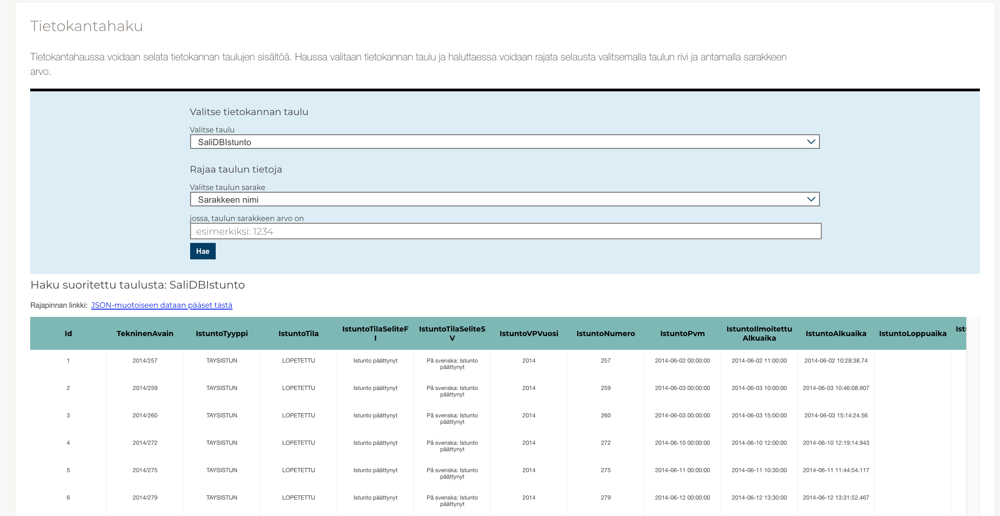

# Development

How to run locally.

## Prerequisites

- Docker
- NodeJS 14
- yarn

## Start dependencies via Docker

The following starts Postgres databases as Docker containers.

```bash
docker-compose up -d
```

Note: the `-d` flag means `--detached`, which starts the containers in the background. You can also run the command without it to get live log output from the containers in your terminal.

If you list running containers, you should see one database for the dev environment, and one for the automated tests:

```shell
$ docker ps
CONTAINER ID        IMAGE               COMMAND                  CREATED             STATUS              PORTS                    NAMES
cd16a9c6663d        postgres            "docker-entrypoint.s…"   27 seconds ago      Up 4 seconds        0.0.0.0:5400->5432/tcp   ekdb_ekdb-dev_1
8718ba7162e9        postgres            "docker-entrypoint.s…"   27 seconds ago      Up 4 seconds        0.0.0.0:5401->5432/tcp   ekdb_ekdb-tests_1
```

Note: you can later remove all the created containers and their resources by running `docker-compose down`.

Next steps to get started would be to run migrations and start the dev server (see below).

## Scripts and commands

The following commands are available.

### Run migrations

```bash
yarn knex migrate:latest
```

### Download data from API

```bash
./bin/download-data --dev
```

Use the `--dev` flag to restrict amount of rows to 10k per table so you don't have to wait for millions of rows to download.

The script creates one huge transaction, and after everything is done, it updates the table `lastDataUpdate` with a timestamp. In case anything goes wrong, the transaction is not committed and the timestamp is not updated.

### (Optional) Download images for members of parliament

The following script finds members in DB without an image, and scrapes their images (if available) from eduskunta.fi:

```bash
./bin/download-member-of-parliament-images
```

Now the web app can be viewed on the host machine at `http://192.168.50.5:3000`.

### Run the server and watch for changes

For development purposes, rebuild on changes:

```bash
$ yarn watch
Listening at http://localhost:3000
```

Effectively this runs `yarn build` and `yarn serve` upon changes.

## Tests

Remember to migrate the test database:

```bash
yarn knex migrate:latest --env testing
```

Run specific tests (no linting) with mocha:

```bash
yarn mocha -g searchFromDb
```

Run all tests (no linting) with mocha:

```bash
yarn mocha
```

Run all tests and lint:

```bash
yarn test
```

## Database structure and data flow

### Schema origin

Database tables are fetched mirrored from [avoindata.eduskunta.fi](http://avoindata.eduskunta.fi).

This page can be used to explore the raw data: https://avoindata.eduskunta.fi/#/fi/dbsearch



There are two scripts related to the schema:

#### Script: [`create-base-migration`](../bin/create-base-migration)

Used to create the initial knex database migration, which creates all the tables mirrored from the remote source. Any future changes to schema after this script was ran are intended to be done as new database migrations.

#### Script: [`store-schema-json`](../bin/store-schema-json)

Used to scrape the remote schema into JSON format, which is used for two purposes:

1. A cached version of the schema for local usage throughout the application
2. Detecting changes in remote schema during CI/build process (build can be made to fail if the schema JSON differs from local version)

All columns in the remote schema are strings. This includes fields which contain dates. See below for how this is handled.

### Aggregate tables

For columns that have `columnType === 'date'` (as determined by the `store-schema-json` script), extra tables are created.

For example, the table `VaskiData` contains a column `Created`, which has been detected to contain date values. An extra table called `VaskiData__DateTime__Created` is created, for storing a DateTime value of the date, so that date-related queries can be executed via joins while keeping the original table structure intact.
